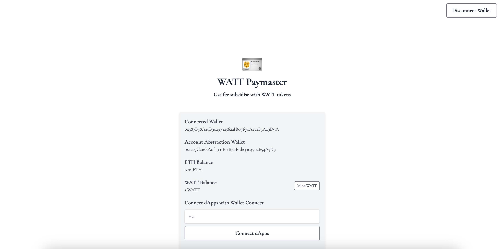
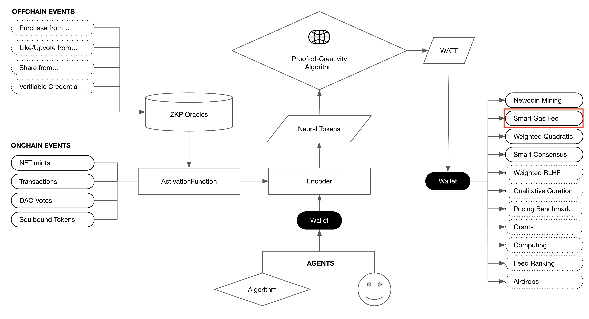
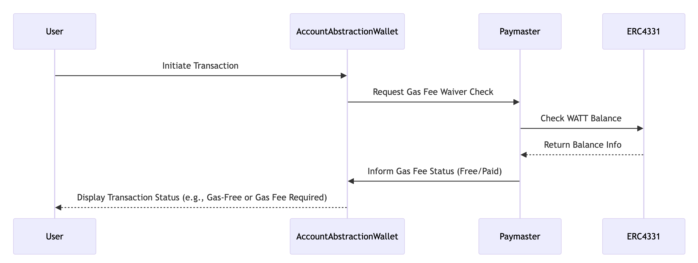

# WATT Paymaster 🪪

Gas fee subsidise with WATT tokens and ERC4331

## Live App

TBD

## Video Demo

TBD

## Pitch Deck

https://docs.google.com/presentation/d/1yMQSy9vpLkLzRkq9aG6DU6iTzRieF38coys5dkti7nw/edit?usp=sharing

## Description

WATT Paymaster 🪪 is an ERC4331 account abstraction paymaster infrastructure that utilizes the WATT token. The ERC4331 standard allows users to perform gas-free transactions via a paymaster.

## How it works

WATT Paymaster provides smart gas fee functions in Newcoin Ecosystem.

The paymaster checks the WATT balance of the account abstraction wallet. If the balance is above a certain threshold, the transaction gas fee becomes free for the user.

